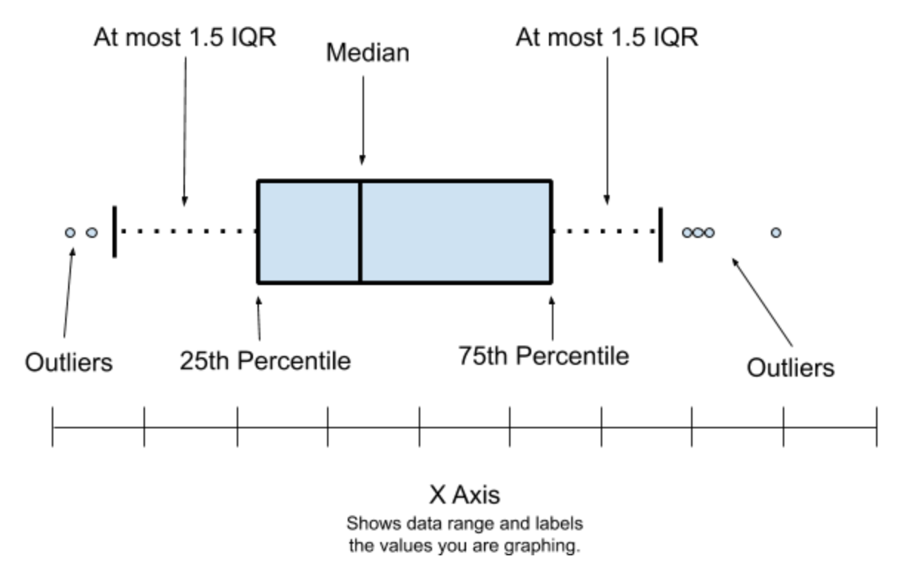

<style>
p.comment {
background-color: #EDBB99;
padding: 10px;
border: 1px solid black;
font-style: italic;
}
</style>

<style>
p.comment1 {
background-color: #A2D9CE;
padding: 10px;
border: 1px solid black;
}
</style>

<style>
p.comment2 {
background-color: #EDBB99; 
padding: 10px;
border: 1px solid black;
}
</style>

<style>
p.comment3 {
background-color: #FDFEFE; 
padding: 10px;
border: 1px solid black;
}
</style>


```{r setup, include=FALSE, context="setup"}
library(tidyverse)
library(learnr)
library(gradethis)
library(checkr)
library(sortable)
library(datasets)

knitr::opts_chunk$set(echo = FALSE)
tutorial_options(exercise.checker = grade_learnr)
tutorial_options(exercise.startover = TRUE)
tutorial_options(exercise.completion = FALSE)

new_recorder <- function(tutorial_id, tutorial_version, user_id, event, data) {
    #cat(tutorial_id, " (", tutorial_version, "): ", user_id, ", ", event, ", ", "\n", sep = "")
  cat(tutorial_id, " (", tutorial_version, "): ", user_id , "\n", sep = "")
  cat("event: ", event, "\n", sep = "")
}

options(tutorial.event_recorder = new_recorder)
```

## What is EDA?

<!--
TODO: Acknowledgements (Peng book, R4DS, NIST handbook, Seltman book)
-->

### Exploratory Data Analysis (EDA)

Exploratory data analysis, or **EDA** for short, is a vague, hard-to-define concept... but is also the activity that will occupy much of your time as a data scientist.

Here's the problem:

* When you first get a dataset, you don't know very much about it. You probably choose the dataset because you thought it might help you solve a particular problem, but you don't know how (or if) the data can help you do that, or what other nuances might be present in the dataset.

* So, the first step is to do a little digging: open the data up, and:

  1. Plot a few basic graphs (EDA is mostly done with graphs because they make it very easy to spot patterns).
  
  2. Calculate some simple statistics (e.g. averages and ranges)

* This basic analysis will probably give you some ideas about the data. You'll probably spot some patterns that bear further investigation, or maybe some issues that you'll need to address.

* How do you do this? More analysis, visualization, and general experimentation, which in turn will reveal more potential patterns, and so the cycle continues...

Your end goal is to find some interesting questions in the dataset that deserve some kind of follow-up.

Does this seem all seem vague and open-ended? That's because it is fundamentally a creative activity. There's no one "right way" to create a painting or a book. Exploratory data analysis is the same. And just like those other creative activities, the way to get better is to practice.


### The importance of visualizations

It is very important to create visualizations as part of exploratory data analysis. Numbers, including summary statistics, can be hard to interpret at best, and misleading at worst.

Consider Anscombe's quartet, a series of 4 small datasets (each has 11 observations of an *x* and a *y* variable).

Here's one of the datasets:

```{r}
anscombe %>%
  select(x1, y1) %>%
  head(11)
```

Here's another:

```{r}
anscombe %>%
  select(x2, y2) %>%
  head(11)
```

The numbers seem pretty similar, right? In fact, the summary statistics are identical:

```{r}
anscombe %>%
  select(x1:y4) %>%
  mutate(index = row_number(x1)) %>%
  gather(x1:y4, key="column", value="value") %>%
  group_by(column) %>%
  summarize(
    mean = mean(value),
    standard.deviation = sd(value)
  )
```

The mean (center) and standard deviation (variation) is the same for all 4 *x*'s, and all 4 *y*'s.

But, if we plot the four distributions...

```{r}
anscombe %>%
  mutate(index = row_number(x1)) %>%
  gather(x1:y4, key="column", value="value") %>%
  separate(column, into = c("dimension", "dataset"), sep=c(1)) %>%
  pivot_wider(names_from=dimension, values_from=value) %>%
  ggplot() +
  geom_point(aes(x,y)) +
  facet_wrap(~dataset, ncol=2)
```

Visualization allows us to detect:

* outliers (points that lie away from the rest)
* characterize relationships between variables: are they linear (straight) or non-linear (curved)?
* identify hypotheses (theories) about the data
* spot problems that might exist in the data

```{r anscombe_outliers_quiz}
question("Which of Anscombe's quartets has outliers?",
  answer("1"),
  answer("2"),
  answer("3", correct = TRUE),
  answer("4", correct = TRUE),
  allow_retry = TRUE
)
```

```{r anscombe_linear_quiz}
question("Which of Anscombe's quartets show a non-linear relationship between $x$ and $y$?",
  answer("1"),
  answer("2", correct = TRUE),
  answer("3"),
  answer("4"),
  incorrect = "When assessing linearity, look at the overall pattern of the majority of data points. One or two points in strange places could just be outliers from an otherwise linear pattern.",
  allow_retry = TRUE
)
```

```{r anscombe_no_relationship_quiz}
question("Do any of Anscombe's quartets have data that might indicate no relationship between $x$ and $y$?",
  answer("1"),
  answer("2"),
  answer("3"),
  answer("4", correct = TRUE, message = "4 could have no relationship if the outlier is a error (rather than a correct observation."),
  incorrect = "One of the quartets has no relationship between $x$ and $y$ for most of the data points, except for one outlier...",
  allow_retry = TRUE
)
```


### Types of graphs

Hopefully you are now convinced why graphing data is important. But what type of graphs should you create?

The rest of this tutorial will go through different types of graphs, but here are some general concepts to bear in mind:

* We can broadly divide EDA into two types: univariate and multivariate

  * Univariate, or "one variable", analysis looks at the **variation** within a single variable's values. Our goal here is to understand the distribution of this variable.
  
  * Multivariate (i.e. "many variables") refers to analysis of 2 or more variables where we want to examine the **covariance** between variables. In other words, how does one variable change in response to changes in another.

* As a general principle, you should do univariate EDA first before multivariate EDA.

* We have put together a flow chart to help you pick the right type of graph for particular types of data and analysis goals: [available as a PDF here](https://drive.google.com/file/d/1zsedQ9kHFtxhFE3R99PQ1a_yTTamJu3e/view?usp=sharing).


## Plotting with `ggplot()`

### From `qplot()` to `ggplot() + ...`

So far we have created graphs with the `qplot()` function from the `ggplot2` package.

However `qplot()` is just a **q**uick plotting function that allows us to make simple graphs. To get access to all the visualization features of the `ggplot2` package, we will need to learn the proper way to create `ggplot` graphs.

For example, instead of using `qplot()` to create a histogram:

```{r, echo=TRUE, warning=FALSE}
qplot(x = height, bins = 30, data = starwars)
```

...we will use an alternative pair of functions, `ggplot()` and `geom_histogram()`, like this:

```{r, echo=TRUE, warning=FALSE}
ggplot(data = starwars) +
  geom_histogram(
    mapping = aes(x = height),
    bins = 30
  )
```

As you can see, the histograms are exactly the same. However, we've avoided this way of creating graphs up until now, because we've been trying to keep our code as simple as possible. 

Now we need to make the trade of slightly more complicated code in exchange for much better graphs. So let's jump in and see how and why this works.


### Graphs as layers

The `ggplot2` package gets its name because it s based on a concept called the *Grammar of Graphics* (hence **gg**plot...). This is a fascinating topic that we unfortunately don't have the time to dive into, but the key idea is that **all data visualizations can be described using a common set of terms and ideas** (i.e. a "grammar").

One of the most important parts of this grammar are the layers that we can add to a graph.

For example, the `ggplot()` function by itself just creates a blank canvas:

```{r, echo=TRUE, warning=FALSE}
ggplot(data = starwars)
```

To actually get something interesting on this graph, we need to take the __data__ and __map__ it to some __geometric__ shape.

For example, if we wanted to map the `height` column of the `starwars` dataset to the geometric shape of a histograms bars, we could use this code:

`geom_histogram(mapping = aes(x = height))`

A few things to note:

* The `geom_histogram()` functions is an example of what we call a *geom function* (each of which specifies a different type of geometry).
* Geom functions have a parameter called `mapping` which, unsurprisingly, tells R how to convert a column of data into a pretty layer.
* The argument that we pass to the `mapping` parameter is a function called `aes()` (this is short for "aesthetic"). Inside the `aes()` function we need to specify any parts of the histogram's appearance that are determined by a column in the dataset.
  * In our example the x-axis of the histogram needs to show the `height` variable.

We then add this layer to the canvas created by `ggplot()`. How do we add things together in R? With the addition operator `+` of course!

And so our final code looks like this:

```r
ggplot(data = starwars) +
  geom_histogram(mapping = aes(x = height))
```

```{r, warning=FALSE}
ggplot(data = starwars) +
  geom_histogram(
    mapping = aes(x = height),
    bins = 30
  )
```


### Aesthetic mappings and other parameters

We refer to this combination of the `mapping` parameter and its `aes()` argument as an *aesthetic mapping*, which is a fancy way of saying how do figure out how to convert columns of the dataset into some visual representation.

But not every part of a graph is determined by data in the dataset. For example, there is no column in the `starwars` dataset that tells us how many bins this histogram should have. Instead we need to specify that number ourself, with another piece of data (i.e. the number of bins).

Since this number is not in the dataset, it is not an aesthetic mapping. Therefore we specify the number of bins as an argument of the `geom_histogram()` function, and not of the `aes()` function, like so:

```{r, warning=FALSE}
ggplot(data = starwars) +
  geom_histogram(
    mapping = aes(x = height),
    bins = 30
  )
```

Do you see how the `geom_histogram()` function has two parameters, `mapping` and `bins`, whereas the `aes()` function has a single parameter (`x`)?

<!--
### Histograms with `ggplot()`
Illustrating position and identity
-->

### Scatter plots with `ggplot()`

Hopefully you are beginning to see that the `ggplot()` syntax uses many of the same parameters as `qplot()`, just in different places.

We can create a scatter plot by switching to a geom function called `geom_point()` and passing an additional column to the `aes()` function to go on the `y` axis:

```{r, echo=TRUE, warning=FALSE}
ggplot(data = starwars) +
  geom_point(
    mapping = aes(x = height, y = mass)
  )
```


### Piping to `ggplot()`

One advantage of `ggplot()` over `qplot()` is that we can pipe a dataframe to `ggplot()` because the first parameter of ggplot() is the dataset to be used.

So instead of explicity passing the `starwars` dataframe to the `data` parameter:

```r
ggplot(data = starwars) + ...
```

...we could write this:

```r
starwars %>%
  ggplot() + ...
```

This might not seem like much, but it does mean that we can put the graphing functions at the end of a series of piped functions that transform and wrangle our dataset, for example:

```r
some_dataset %>%
  mutate(...) %>%
  filter(...) %>%
  ggplot() + geom_FUNCTION(...)
```


## Starting EDA

### A "first steps" EDA checklist

Here's a checklist of things to check when you begin EDA on a dataset.

1. Formulate your question

2. Load the data

3. Check the dataset's documentation

4. Get an overview of the data

6. Look at the first and last rows of your dataframe

6. Make sure the data makes sense

7. Start the EDA cycle.

Based on: [Exploratory Data Analysis, Chapter 4](https://bookdown.org/rdpeng/exdata/exploratory-data-analysis-checklist.html), a free online book by Roger Peng, a professor of biostatistics at Johns Hopkins University.

### Formulate your question

It's generally a good idea to go into EDA with a question in mind.

The question doesn't have to be perfect - indeed, you might well decide that the question can be improved after you've explored the data.

However, having a question in mind allows us to focus our EDA and not get distracted by the huge number of possibilities that we can explore with a single dataset.

So: *what makes a good question?*

In general, we want:

* to be as specific as possible,

* while still being interesting.

Specificity is good because it makes our analysis shorter and more direct. Broad questions are often of more general interest, but it is harder to come up with an approach to answering them.

An analogy is a New Year's resolution: consider "Exercise more" vs. "Go for a 30 minute run 3x per week." One of these is specific and measureable (while still be relevant to the overall goal of increasing your fitness), while the other is much broader and less-defined (and potentially easier to weasel out of...).

For this tutorial, our starting question will be:

> What is the effect of the size of a diamond on its price?

This is a better starting place that a broader question such as "What factors influence diamond prices?" Where would we start with such a question? Not only would we want data on the physical characteristics of diamonds, but probably also on the supply of diamonds, the controls imposed by diamond cartels, the effect of advertizing to make diamonds seem exclusive, popular campaigns against blood diamonds... we could spend all day just thinking about the question, and never get to the actual EDA!

### Load the data

For this tutorial, we will be using the `diamonds` dataset, which is automatically loaded with the `ggplot2` graphing package.

This means that you just need to run `library(ggplot2)` or `library(tidyverse)` (the `tidyverse` meta-package includes `ggplot2`), and the diamonds dataset will be available for you to use.

In the real world, loading data tends to be a much messier task (a topic for another day).

### Check the dataset's documentation

Most datasets come with documentation describing the data that they contain.

In R, most datasets that come as part of a package have some kind of documentation page. In RStudio, you can bring this up by running `?name_of_dataset` in the console, e.g. `?diamonds`. That won't work in this tutorial, but you can also see the `diamonds` documentation page online here: [https://ggplot2.tidyverse.org/reference/diamonds.html](https://ggplot2.tidyverse.org/reference/diamonds.html)

### Get an overview of the data

We can use the `glimpse` function to get a compact overview of a dataframe.

Note: the `glimpse` function is a modern "tidyverse" version of an older R function called `str`.

<p class="comment3">
Run the `glimpse` function to get an overview of the columns in the `diamonds` dataset.
</p>

```{r qafosdhqdvbhhvdf, exercise = TRUE}

```

```{r qafosdhqdvbhhvdf-hint}
"The syntax for the glimpse function is glimpse(name_of_dataframe)"
```


```{r qafosdhqdvbhhvdf-solution}
# solution code
glimpse(diamonds)
```

```{r qafosdhqdvbhhvdf-check}
# check code
gradethis::grade_code()
```


```{r diamonds_carat_type_quiz}
question("What type of data does the carat variable hold?", 
  answer("Continuous", message = "Carat is the weight of the diamond, which is continuous.", correct=TRUE),
  answer("Categorical"),
  allow_retry = TRUE
  )
```


```{r diamonds_cut_type_quiz}
question("What type of data does the cut variable hold?", 
  answer("Continuous"),
  answer("Categorical", message = "glimpse tells us that cut is an `Ordered factor`. A factor is the data type R uses to hold categorical variables. A factor has levels, which have labels (e.g. 'Fair' or 'Good' for cut), but in each row the levels are referred to by their number (to save space).", correct=TRUE),
  allow_retry = TRUE
  )
```


### Look at the first and last rows of your dataframe

Sometimes dataset creators start with grand intentions, but motivation or reality gets in the way. Because of this, the data at the top of datasets often looks great. However, the last rows in the dataset may contain incomplete or problematic data that got added on at the end.

We can examine both the first and last rows of the dataset with the `head` and `tail` functions respectively. The syntax of these functions is `head(dataset_name)`, e.g.:

```{r, echo = TRUE}
head(diamonds)
```

to display 6 rows from the top (or bottom) of the dataset. We can change the number of rows to display with the second argument:

```{r, echo = TRUE}
head(diamonds, 10)
```

We could also rewrite the previous code chunk using the pipe operator:

```{r, eval=FALSE, echo=TRUE}
diamonds %>%
  head(10)
```


<p class="comment3">
Use the `tail` function to display the **last 8 rows** of the diamonds dataframe. Note that this code uses the pipe operator `%>%` to supply the first.
</p>

```{r cqimxllkpywvjfns, exercise = TRUE}
# Replace the blanks with either a function name, or a number
diamonds %>%
  _____(___)
```

```{r cqimxllkpywvjfns-solution}
# solution code
diamonds %>%
  tail(8)
```

```{r cqimxllkpywvjfns-check}
# check code
gradethis::grade_code()
```

As you can see, the `diamonds` data is actually pretty nice at both the top and the bottom (as you might hope for an "offical" ggplot dataset). The example datasets that come with packages are often nice like this - unfortunately real-world data is usually less friendly.


### Make sure that the data makes sense

We expect certain things about our dataset to be true:

* Does the dataset have the correct number of rows and columns?
* Do the numbers in each column make sense: 
  * does a column called `date` contain dates, or does it have random numbers that don't seem to be dates?
  * does a column called `USA_states` contain all 50 states as you might expect? Or does it also contain "non-state" regions such as the District of Columbia and Puerto Rico.
* What is an observation in the dataset? 
  * In the `diamonds` dataset, each row represents a different diamond. This is probably what you would expect. But what if the dataset rows each represented a *diamond store* instead, and the numbers were the average of all the diamonds in that shop? In this scenario, the data (and what questions we can ask with it) would be very different.
* Are the values plausible?
  * For example, in the `diamonds` dataset, are the prices for the diamonds realistic? Is the range of values of the `carat` variable realistic (for example, most diamonds are pretty small, so if this dataset claimed to have data on 50,000 diamonds that were all 100 carats or larger, then we might be a little suspicious...)


### Start the EDA cycle.

Now that you've verified the data, you can start on the EDA process. 

As a reminder, we usually want to *start with univariate analysis* of each variable separately. Programs and data are both complicated, so it is always a good idea to start small and simple, and add in complexity gradually.

If we do the opposite and start complicated, it is easy to make small mistakes and assumptions which might make our final conclusions wrong!

## Univariate variation

### Non-graphical methods (i.e. summary statistics)

If a variable is categorical, we can summarize it by looking at the proportions of observations in different categories:

```r
dataframe %>%
  group_by(categorical_variable) %>%
  summarize(
    count = n(),
    proportion = n() / nrow(.),
    percentage = 100 * proportion
  )
```

Notes on this code:

  * the `n()` function returns the number of rows. It does not need an argument.
  * the `nrow()` function also calculates the number of rows, but needs an argument (a variable who's rows it should count).
  * the `.` argument inside `nrow` is used to refer to the original `dataframe` that we piped in.

<p class="comment3">
Calculate summary statistics for the categorical `cut` column of the `diamonds` dataframe.
</p>

```{r lwsyhxxvndkapsgg, exercise = TRUE}
# Replace the blanks, following the template above
diamonds %>%
  group_by(____) %>%
  _____(
    count = n(),
    proportion = ______,
    _____ = _______
  )
```

```{r lwsyhxxvndkapsgg-hint-1}
# hint text
"You will need to fill in the categorical variable to group by, the `summarize` function, and the three expressions inside the summarize function"
```

```{r lwsyhxxvndkapsgg-solution}
# solution code
diamonds %>%
  group_by(cut) %>%
  summarize(
    count = n(),
    proportion = n() / nrow(.),
    percentage = 100 * proportion
  )
```

```{r lwsyhxxvndkapsgg-check}
# check code
gradethis::grade_code()
```

For a continuous variable, we typically use a few statistics (a number representative of other numbers) to summarize the:

1. center (i.e. mean, median, mode), &

2. spread (e.g. the standard deviation, the range, the interquartile range, etc.)

of a distribution.

```r
dataframe %>%
  summarize(
    mean    = mean(continuous_variable),
    median  = median(continuous_variable),
    std.dev = sd(continuous_variable),
    iqr     = IQR(continuous_variable),
    min     = min(continuous_variable),
    max     = max(continuous_variable)
  )
```

<p class="comment3">
Calculate summary statistics the 6 summary statistics listed above for the continuous variable `carat` from the `diamonds` dataframe.
<p>

```{r rsrzqnjqelsdcbxe, exercise = TRUE}
# Fill in the blanks:
diamonds %>%
  summarize(
    mean    = mean(____),
    median  = _______,
    std.dev = _______,
    ________,
    ________,
    ________
  )
```

```{r rsrzqnjqelsdcbxe-solution}
# solution code
diamonds %>%
  summarize(
    mean    = mean(carat),
    median  = median(carat),
    std.dev = sd(carat),
    iqr     = IQR(carat),
    min     = min(carat),
    max     = max(carat)
  )
```

```{r rsrzqnjqelsdcbxe-check}
# check code
gradethis::grade_code()
```

In our original question, we were interested in two variables: size (i.e. `carat`) and `price`. We should therefore calculate summary statistics for the `price` variable as well

<p class="comment3">
Repeat your summary statistics calculation for the continuous variable `price`.
<p>

```{r cybpzfzntosxuqtr, exercise = TRUE}
# One big blank to fill in this time!
diamonds %>%
  _______
```

```{r cybpzfzntosxuqtr-hint-1}
# hint text
"You should be able to just change the variable in you previous code from carat to price"
```

```{r cybpzfzntosxuqtr-solution}
# solution code
diamonds %>%
  summarize(
    mean    = mean(price),
    median  = median(price),
    std.dev = sd(price),
    iqr     = IQR(price),
    min     = min(price),
    max     = max(price)
  )
```

```{r cybpzfzntosxuqtr-check}
# check code
gradethis::grade_code()
```

### Graphical analysis of `carat`

With graphs, we want to visualize the distribution of a variable.

Two good graphs for visualizing the distributions of one continuous variable are histograms and boxplots. (You might also want to look up density plots and violin plots on the ["What graph should I plot" cheatsheet](https://drive.google.com/file/d/1zsedQ9kHFtxhFE3R99PQ1a_yTTamJu3e/view?usp=sharing).)

<p class="comment3">
Create a histogram of the `carat` variable.
</p>

```{r fahlctbqxqfcqwpn, exercise = TRUE}
diamonds %>%
  ggplot() +
  _______(mapping = aes(______))
```

```{r fahlctbqxqfcqwpn-solution}
# solution code
diamonds %>%
  ggplot() +
  geom_histogram(mapping = aes(x = carat))
```

```{r fahlctbqxqfcqwpn-check}
# check code
gradethis::grade_code()
```

Plots of distributions show common versus less common values of a variable. This allows us to answer questions like:

* What values are common? Does this match your prior expectations?
* What values are uncommon? Again, does this match your prior expectation?
* Does the overall appearance show any unusual patterns that bear further investigation?

One thing you might note is that the distribution is not very smooth. To make it smoother, we could increase the size of the bins. However, to see what's going on with this distribution, let's *decrease* the bin size.

<p class="comment3">
Create another histogram of the `carat` variable, but this time set the `binwidth` parameter to 0.01
</p>

```{r lqdlcrkzyiczdqtn, exercise = TRUE}
diamonds %>%
  ggplot() +
  geom_histogram(__________)
```

```{r lqdlcrkzyiczdqtn-hint-1}
# hint text
"binwidth is a fixed value. Therefore, should it go as a parameter of the geom_histogram function or the aes function?"
```

```{r lqdlcrkzyiczdqtn-solution}
# solution code
diamonds %>%
  ggplot() +
  geom_histogram(mapping = aes(x = carat), binwidth = 0.01)
```

```{r lqdlcrkzyiczdqtn-check}
# check code
gradethis::grade_code()
```

Interesting! There's an odd sawtooth pattern to this data that suggests several clusters to the data. This pattern raises several interesting questions:

* What's causing these groups ("clusters")?
* Why does each cluster have a sharp left-hand side, and a long tail on the right?

### `price` visualization

We also want to look a the distribution of the `price` variable. Let's do that with a new type of graph: the box plot.

Box plots (also called box-and-whisker plots) visualize not only the distribution but also show several summary statistics:

```{r}

```

We create a box plot using the `geom_boxplot` geom function. There are two required aesthetic mappings in a box plot (note that in `ggplot` the orientation of the boxplot is rotated 90 degrees): 

* `x` should be a categorical variable to create different box plots for.
* `y` is the variable that we want to show the distribution of.

```{r}
diamonds %>%
  ggplot() +
  geom_boxplot(mapping = aes(x = cut, y = price))
```


You might have spotted a problem here: what if we only want to create one box plot rather that breaking down the variable into a different box plot for each category of `x`? In this case, we need to provide a character string to `x` instead of a variable name - however, despite the fact that x is a fixed value, it still goes inside the `aes` function...

<p class="comment3">
Create a single box plot of the `price` variable by providing the string `"price"` as the argument to the `x` parameter.
</p>

```{r ixzvzwepjdibpkvq, exercise = TRUE}
# Fill in the blank:
diamonds %>%
  ggplot() +
  geom_boxplot(mapping = aes(x = _____, y = price))
```

```{r ixzvzwepjdibpkvq-solution}
# solution code
diamonds %>%
  ggplot() +
  geom_boxplot(mapping = aes(x = "price", y = price))
```

```{r ixzvzwepjdibpkvq-check}
# check code
gradethis::grade_code()
```


### Violin plots

An alternative to the boxplot is the violin plot. This combines aspects of the histogram and boxplot into a single graph.

The code for a violin plot is almost identical to the code or a boxplot - we just use the `geom_violin()` geom function:

```{r, echo=TRUE}
diamonds %>%
  ggplot() +
  geom_violin(mapping = aes(x = "price", y = price))
```

### Labeling our graphs

It is good practice to label all the graphs we create. We can do this by adding the `labs()` function to a graph:

```{r, echo=TRUE}
diamonds %>%
  ggplot() +
  geom_violin(mapping = aes(x = "price", y = price)) +
  labs(title = "Violin plot of price", y = "price ($)")
```

Notice how:

* the `labs()` function is a separate function that we add on to the graph as a separate layer with the `+` operator
* inside the `labs()` function, we can supply an argument to the `title` parameter to change the title, and the `y` (and `x`) arguments to change the labels on those axes.

<p class="comment3">
Using the `labs()` function, add a title and y-axis label to the boxplot of `price` that you created earlier (we will leave the x-axis label as its default, since that is adequate for this graph.)
</p>

```{r boxplot_labels_exercise, exercise = TRUE}
# Fill in the blanks:
diamonds %>%
  ggplot() +
  geom_boxplot(mapping = aes(x = "price", y = price)) +
  _____(_____ = "A boxplot of price", _____ = "price ($)")
```

```{r boxplot_labels_exercise-solution}
# solution code
diamonds %>%
  ggplot() +
  geom_boxplot(mapping = aes(x = "price", y = price)) +
  labs(title = "A boxplot of price", y = "price ($)")
```

```{r boxplot_labels_exercise-check}
# check code
gradethis::grade_code()
```


## Multivariate covariation

When we have multiple variables we want to understand how their variation is related: this is called **covariation**.

<!--
### Non-graphical (i.e. summary statistics)
See:
- NIST handbook: https://www.itl.nist.gov/div898/handbook/eda/section3/eda35.htm
- Section 4.4: https://www.stat.cmu.edu/~hseltman/309/Book/chapter4.pdf
- mathematical covariance (and relationship to R-squared) + graphical interpretation with heat map (correlation plot)
-->

### Graphical

If you have two continuous variables, such as `price` and `carat` in the `diamonds` dataset, then a scatter plot is generally a good method of examining their covariation:

<p class="comment3">
Create a scatter plot with `price` on the y-axis and `carat` on the x-axis.
</p>

```{r kfxhpnqgmtclqbkt, exercise = TRUE}
diamonds %>%
  ggplot() +
  ______ +
  labs(title = "Scatter plot of dimond price vs size", y = "price ($)", x = "size (carats)")
```

```{r kfxhpnqgmtclqbkt-solution}
diamonds %>%
  ggplot() +
  geom_point(mapping = aes(x = carat, y = price)) +
  labs(title = "Scatter plot of dimond price vs size", y = "price ($)", x = "size (carats)")
```

```{r kfxhpnqgmtclqbkt-check}
# check code
gradethis::grade_code()
```

We can see several things about this graph:

* There's obviously a positive relationship between these two variables.
* It's hard to tell the density of the points (i.e. where most of the points fall), because in many places all the point overlap in a blog.

We have a several options to show density.

* We could make the points transparent with the `alpha` parameter. Then dense regions would be darker (because there would be many overlapping transparent points). For example, with `alpha = 0.1`:

  ```{r, echo = TRUE}
  diamonds %>%
    ggplot() +
    geom_point(mapping = aes(x = carat, y = price), alpha=0.1) +
    labs(title = "Scatter plot of dimond price vs size", y = "price ($)", x = "size (carats)")
  ```

* We can also create a heat map, which is a colored grid where the intensity of the color represents a value on a scale - in this case, the color represents the density. This uses the `geom_bin2d` geom function:

  ```{r, echo = TRUE}
  diamonds %>%
    ggplot() +
    geom_bin2d(mapping = aes(x = carat, y = price)) +
    labs(title = "Heat map of dimond price vs size", y = "price ($)", x = "size (carats)")
  ```
  
  This is essentially a 2-dimensional histogram. Each square is like a bar in a univariate histogram. In this heat map, the color represents the "height" of the 2-dimensional bin, i.e. how many diamonds fall into each cell of the heat map's grid.

<!-- Todo
Have students recreate this graph
-->

<!--

TODO:
Faceting... since its in the quiz...

-->


## Your turn

### Do some EDA

There are all kinds of other graphs we can plot.

In the code cells below, experiment on your own with some exploratory data analysis of the `diamonds` dataset.

From our previous explorations, it there is a positive relationship between `price` and `carat`; in other words, as one variable increases, so does the other. However:

* the relationship was not perfect: there seemed to be some uneven scatter. What other variables might be influencing this relationship?

* relatedly, what other variables are related to price (& what is the variation within those other variables by themselves)?

In the following code boxes, play around with some EDA of your own. You might find it helpful to look at the ["What graph should I plot" cheatsheet](https://drive.google.com/file/d/1zsedQ9kHFtxhFE3R99PQ1a_yTTamJu3e/view?usp=sharing) for inspiration, and remember that you can always Google a geom function (or ask an instructor) to get more information on how to use it.

```{r dmscqgizgqobassd, exercise = TRUE}


```

```{r iemrbivllnatvsyb, exercise = TRUE}


```

```{r jqfjswlmbfodoaaw, exercise = TRUE}


```

```{r efylzsvfvlntqbyz, exercise = TRUE}


```

<!--
TODO
## Patterns, models, and inference
-->


