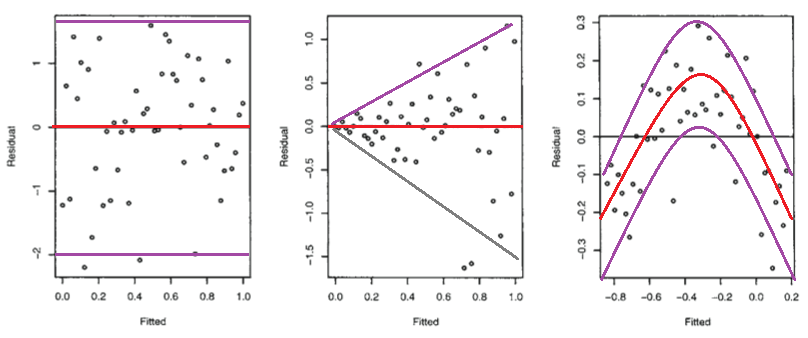

<style>
p.comment {
background-color: #EDBB99;
padding: 10px;
border: 1px solid black;
font-style: italic;
}
</style>

<style>
p.comment1 {
background-color: #A2D9CE;
padding: 10px;
border: 1px solid black;
}
</style>

<style>
p.comment2 {
background-color: #EDBB99; 
padding: 10px;
border: 1px solid black;
}
</style>

<style>
p.comment3 {
background-color: #FDFEFE; 
padding: 10px;
border: 1px solid black;
}
</style>


```{r setup, include=FALSE}
library(tidyverse)
library(learnr)
library(gradethis)
library(checkr)
library(sortable)
library(modelr)
library(broom)
library(plotly)

knitr::opts_chunk$set(echo = FALSE)
tutorial_options(exercise.checker = grade_learnr)
tutorial_options(exercise.startover = TRUE)
tutorial_options(exercise.completion = FALSE)

new_recorder <- function(tutorial_id, tutorial_version, user_id, event, data) {
    #cat(tutorial_id, " (", tutorial_version, "): ", user_id, ", ", event, ", ", "\n", sep = "")
  cat(tutorial_id, " (", tutorial_version, "): ", user_id , "\n", sep = "")
  cat("event: ", event, "\n", sep = "")
}

options(tutorial.event_recorder = new_recorder)

set.seed(42)
x <- 1:10 + rnorm(10, 0, 0.5)
y <- 2*x + rnorm(10, 0, 1)
sim_df <- tibble(x, y)
```

## Models in more dimensions

### Multiple explanatory variables

In our previous module on linear models, we considered what is called *simple linear regression*: a linear model with just one explanatory variable, $x$:

$y = m \times x + c$

which we created using the `lm` function.

However, we can technically have as many explanatory variables in our model as we like! (But we can only ever have a single response variable, $y$) For example, this model has *two explanatory variables*, called $x_1$ and $x_2$ to differentiate them:

$y = m_1 \times x_1 + m_2 \times x_2 + c$

Note:

* each explanatory variable gets its own coefficient ($m_1$ and $m_2$)
* there is still just a single intercept, $c$

### But what does that look like?

We can pretty easily plot $y$ vs a single explanatory variable $x$. In this case, a linear model is just a best-fit line through the data:

```{r}
set.seed(42)
x <- 1:10 + rnorm(10, 0, 0.5)
y <- 2*x + rnorm(10, 0, 1)
sim_df <- tibble(x, y)
```

But what does a linear model look like in higher dimensions?

```{r}
# Code adapted from https://chart-studio.plotly.com/~diego898/122/_3d-plane-of-best-fit-through-generated-dummy-data/#code
trace1 <- list(
  uid = "5c56cf7b-dc4c-4dfa-b691-728a6a9e1b6b", 
  mode = "markers", 
  name = "Data", 
  type = "scatter3d", 
  x = c(3.882026172983832, -0.3627411659871381, -0.8540957393017248, 1.3263858966870303, -0.461584604814709, 1.9436211856492926, -1.6020576556067476, -0.4017809362082619, -0.977277879876411, 0.37816251960217356, -0.30230275057533557, -0.7474548114407578, -0.1871838500258336, 0.3187276529430212, -1.5362436862772237, 0.4001572083672233, -0.8264385386590144, -0.7421650204064419, 0.7065731681919482, 0.9008264869541871, -0.5788496647644155, -0.20829875557799488, 0.681594518281627, 0.8024563957963952, 0.7774903558319101, -1.5447710967776116, 0.9693967081580112, 0.6764332949464997, 1.7858704939058352, 1.5430145954067358, 0.05616534222974544, -0.2127402802139687, -0.3595531615405413, -1.2348258203536526, 0.15634896910398005, 0.41059850193837233, -0.1550100930908342, 1.2023798487844113, 0.40198936344470165, -1.0799315083634233, 0.9222066715665268, -0.6895497777502005, -0.1715463312222481, 0.0875512413851909, 1.8958891760305832, -0.6634782863621074, 1.8492637284793418, 0.33367432737426683, -1.3749512934180188, 1.469358769900285, 0.01747915902505673, -1.180632184122412, 0.26705086934918293, 1.117016288095853, 1.454273506962975, 2.240893199201458, -0.14963454032767076, 0.9060446582753853, -1.1680934977411974, -0.6510255933001469, -1.980796468223927, -0.4380743016111864, 0.8443629764015471, 1.2224450703824274, 0.6350314368921064, 0.386902497859262, -0.20515826376580087, 0.12898291075741067, 1.336527949436392, 1.9507753952317897, 1.4805147914344243, 0.3169426119248496, -2.2234031522244266, 1.7133427216493666, 0.3024718977397814, 0.12167501649282841, -1.4200179371789752, 0.4393917012645369, -0.17992483581235091, -0.6848100909403132, -1.0994007905841945, -0.1513572082976979, -0.43782004474443403, 0.05194539579613895, -1.0930615087305058, 0.40746183624111043, 0.5392491912918173, 1.9100649530990337, 0.42833187053041766, 0.6536185954403606, 0.9444794869904138, 0.03183055827435118, 1.9295320538169858, -1.4543656745987648, 0.4627822555257742, 0.8235041539637314, 0.9766390364837128, -1.3477590611424464, 0.052165079260974405, -1.7262826023316769), 
  y = c(3.882026172983832, -0.6343220936809636, 0.31306770165090136, 0.298238174206056, -1.3159074105115212, -1.17312340511416, 0.6252314510271875, 0.17742614225375283, 1.8675579901499675, 0.1549474256969163, -0.3873268174079523, -0.41361898075974735, 0.04575851730144607, 0.920858823780819, 0.46566243973045984, 1.764052345967664, -0.7447548220484399, 0.8644361988595057, 0.3563663971744019, -1.1651498407833565, -0.8707971491818818, 0.5765908166149409, -1.0342428417844647, -0.2680033709513804, -1.2527953600499262, -1.0002153473895647, -1.2704849984857336, -0.635846078378881, 0.010500020720820478, -0.7395629963913133, -0.31155253212737266, -1.6138978475579515, -0.672460447775951, 1.1394006845433007, -0.3479121493261526, -0.10321885179355784, 0.947251967773748, 1.2302906807277207, 0.12691209270361992, 1.126635922106507, 0.6140793703460803, -0.8034096641738411, 0.5232766605317537, 0.9494208069257608, 1.4882521937955997, -0.0984525244254323, -0.43515355172163744, 0.44386323274542566, -0.35399391125348395, 1.5327792143584575, -0.45553250351734315, -0.510805137568873, -1.2928569097234486, -0.9128222254441586, 0.144043571160878, 0.9787379841057392, -0.6945678597313655, 1.8675589604265699, -0.0392828182274956, 0.8568306119026912, -0.8877857476301128, -0.5096521817516535, -1.225435518830168, -0.40317694697317963, 0.16667349537252904, -0.8954665611936756, 1.4940790731576061, 0.7290905621775369, 2.16323594928069, -1.7062701906250126, 1.9229420264803847, 1.1880297923523018, -0.6436184028328905, -0.06824160532463124, 0.06651722238316789, 0.7610377251469934, -1.0485529650670926, -1.4912575927056055, 1.1787795711596507, 0.402341641177549, 0.37642553115562943, 0.9500884175255894, -1.1474686524111024, -0.9072983643832422, 0.3960067126616453, 0.6722947570124355, -0.7699160744453164, -0.8612256850547025, -0.028182228338654868, -2.5529898158340787, 2.383144774863942, -0.6743326606573761, -0.4980324506923049, 2.2697546239876076, -1.6301983469660446, 0.7717905512136674, 0.2082749780768603, 1.8831506970562544, -1.1043833394284506, -0.813146282044454), 
  z = c(0.6014148753050095, 52.76493680024886, 28.830181943943813, -52.751941211785535, -116.76325181356648, -185.65277987329165, 166.9266453026271, -32.74004418686453, 200.35475438264095, 84.07114839099326, -388.7351875153565, 44.1641313590487, 124.12766472786151, 11.33498950758262, 137.75319692929813, 69.93385864098357, 30.233468047331854, 165.09992349889487, 132.69190946366308, -206.11535605233962, 26.99732219416606, 365.6174266134817, -31.784900223469393, -165.8343459440985, -146.27731910939744, 10.210615390490545, -50.87361679224105, -110.51610451997985, -114.91059728659813, -9.211078415251677, -12.345496216569781, -150.20963346355904, -81.6021418991762, 62.37725640290973, 71.2915984442432, -79.86847898246879, 72.68455508109857, 75.95651283788784, -31.44557337935764, 282.6790798921676, -80.04878296553002, -34.87737844022634, 80.0106052206387, 70.59644155587, 36.88090048841791, -20.960391883243197, -215.60192693204198, 56.02926881751827, -39.22168581135089, 109.19498731579706, -92.38694595459536, -75.30341111686698, -130.22720888849, -185.3731571473548, 105.22665586124084, 14.144545758253031, 2.9242732489158243, 1.1669016364443507, 121.87838283834178, -46.94177432519599, -50.010839552593836, -26.167096300997564, -6.079239773173526, -84.7611095980838, 110.21636367129128, -224.15927360347007, 186.41050332336596, 7.169682592501054, 102.77209750471626, -21.581724138016796, 308.8768868115247, 229.41389106695559, -5.206358355322031, 83.9845870497286, -62.87852405647838, 5.928508882708712, -235.1797972236149, -258.92704556152404, 24.750468381961923, -112.63339759970111, 39.835715392615406, 143.7387638843515, -142.56710308804608, -60.880299394084815, 123.9687416050054, 76.25604817699059, -37.495883472786346, -162.4630155758125, -20.648920355074306, -280.80620838340803, 201.0298512682453, -72.25885831763277, 35.049556162643526, 270.53472727948645, -193.10382080579126, 114.09991346642917, -88.86871570838584, 282.071569269954, -79.07507692577363, -154.61086620064873), 
  marker = list(
    size = 2, 
    opacity = 0.9
  )
)
trace2 <- list(
  uid = "f606e49f-bb1b-4d74-acc9-a9d80027e663", 
  name = "Plane of Best Fit", 
  type = "surface", 
  x = matrix(c(-3, -2, -1, 0, 1, 2, 3, -3, -2, -1, 0, 1, 2, 3, -3, -2, -1, 0, 1, 2, 3, -3, -2, -1, 0, 1, 2, 3, -3, -2, -1, 0, 1, 2, 3, -3, -2, -1, 0, 1, 2, 3, -3, -2, -1, 0, 1, 2, 3), nrow=7, ncol=7), 
  y = matrix(c(-3, -3, -3, -3, -3, -3, -3, -2, -2, -2, -2, -2, -2, -2, -1, -1, -1, -1, -1, -1, -1, 0, 0, 0, 0, 0, 0, 0, 1, 1, 1, 1, 1, 1, 1, 2, 2, 2, 2, 2, 2, 2, 3, 3, 3, 3, 3, 3, 3), nrow=7, ncol=7), 
  z = matrix(c(-168.76593592211438, -198.5860701810799, -228.40620444004537, -258.2263386990109, -288.0464729579764, -317.8666072169419, -347.6867414759074, -82.74318014958601, -112.56331440855152, -142.38344866751703, -172.2035829264825, -202.02371718544802, -231.8438514444135, -261.663985703379, 3.279575622942346, -26.540558636023157, -56.36069289498866, -86.18082715395416, -116.00096141291965, -145.82109567188516, -175.64122993085067, 89.3023313954707, 59.4821971365052, 29.662062877539697, -0.15807138142580102, -29.9782056403913, -59.7983398993568, -89.6184741583223, 175.32508716799907, 145.50495290903356, 115.68481865006805, 85.86468439110256, 56.044550132137054, 26.22441587317156, -3.595718385793944, 261.3478429405274, 231.5277086815619, 201.7075744225964, 171.8874401636309, 142.0673059046654, 112.24717164569992, 82.42703738673441, 347.37059871305576, 317.5504644540903, 287.7303301951248, 257.91019593615925, 228.09006167719377, 198.2699274182283, 168.44979315926278), nrow=7, ncol=7), 
  opacity = 0.7, 
  showscale = FALSE, 
  colorscale = "Greys"
)
data <- list(trace1, trace2)
layout <- list(
  scene = list(
    xaxis = list(title = list(text = "x1")), 
    yaxis = list(title = list(text = "x2")), 
    zaxis = list(title = list(text = "y"))
  ), 
  title = list(text = "3D Plane of Best Fit Through 2 Explanatory Variables"), 
  margin = list(
    b = 10, 
    l = 0, 
    r = 0, 
    t = 100
  )
)
p <- plot_ly()
p <- add_trace(p, uid=trace1$uid, mode=trace1$mode, name=trace1$name, type=trace1$type, x=trace1$x, y=trace1$y, z=trace1$z, marker=trace1$marker)
p <- add_trace(p, uid=trace2$uid, name=trace2$name, type=trace2$type, x=trace2$x, y=trace2$y, z=trace2$z, opacity=trace2$opacity, showscale=trace2$showscale, colorscale=trace2$colorscale)
p <- layout(p, scene=layout$scene, title=layout$title, margin=layout$margin)

p
```

As you can see, in three dimensions we have a *plane* of best fit rather than a line (note: you should be able to zoom and rotate the 3D graph).

In fact, we can have more than 2 explanatory variables. Although we can't realistically visualize 4 or more dimensions, you can think of a high dimensional linear model as a high dimensional plane: a *hyperplane*.

However, as we shall see, our inability to plot high dimensional linear models makes it impossible to assess the linear model's assumptions by plotting the original data. Instead we will create alternative plots that reduce each assumption down to a 2D graph.

## Multiple regression in R

### `lm` with multiple explanatory variables

Recall that the first argument of the `lm` function was a formula. We create an R formula by:

* removing the constant coefficients
* replacing the $=$ sign with `~` (~ means "is related to")

For example,

$y = m x + c$

becomes

`y ~ x`

The same principle applies to multiple explanatory variables:


$y = m_1 x_1 + m_2 x_2 + c$

becomes

`y ~ x1 + x2`

<p class="comment3">
For each of the following questions, identify the correct R formula (or original linear model equation). Some questions assume that the data is in a data frame called `df`.
</p>

<!--
TODO:
- include feedback on these question
-->

```{r formula1_quiz}
question(
  "What is the correct R formula for this equation: ${Price} = m_1 \\times {Bedrooms} + m_2 \\times {Sqft} + c$ ?",
  answer("`y ~ x1 + x2`"),
  answer("`Bedrooms + Sqft ~ Price`"),
  answer("`Price + Bedrooms + Sqft`"),
  answer("`Price ~ Bedrooms + Sqft`", correct = TRUE),
  allow_retry = TRUE
)
```

```{r formula2_quiz}
question(
  "What is the equation behind this R formula: `cost ~ labor + goods` ?",
  answer("$y = m_1 x_1 + m_2 x_2 + c$"),
  answer("${cost} = m_1 \\times {labor} + m_2 \\times {goods} + c$", correct = TRUE),
  answer("$y = m_1 \\times {labor} + m_2 \\times {goods} + c$"),
  answer("`Cost ~ Labor + Goods`"),
  allow_retry = TRUE
)
```

```{r formula3_quiz}
question(
  "How would you create this linear model in R? ${Price} = m_1 \\times {Bedrooms} + m_2 \\times {Sqft} + c$",
  answer("`lm(Price ~ Bedrooms + Sqft, data = df)`", correct = TRUE),
  answer("`lm(Price ~ Bedrooms + Sqft)`"),
  answer("`df %>% lm(Price ~ Bedrooms + Sqft)`"),
  answer("`Price ~ Bedrooms + Sqft`"),
  allow_retry = TRUE
)
```

<!--
TODO
- actual code exercises on this
-->

### Create a multiple regression model

<!-- 
TODO
- switch to a smaller dataset that does not take so long to generate graphs
-->

Let's create a linear model from the `diamonds` dataset.

The `diamonds` dataset is included as part of the `ggplot2` package and contains observations about the properties of thousands of diamonds. We are going to use three variables from the dataset:

* the `price` variable will be our response variable (i.e. y)
* the `carat` and `depth` variables will be our explanatory variables

<p class="comment3">
Fill in the blanks to create this linear model.
</p>

```{r kovzhddvrmedbxrc, exercise = TRUE}
diamonds_model <- lm(_____ ~ _______ + _______, data = _______)
```

```{r kovzhddvrmedbxrc-solution}
diamonds_model <- lm(price ~ carat + depth, data = diamonds)
```

```{r kovzhddvrmedbxrc-check}
# check code
gradethis::grade_code()
```

<!--
TODO
- section on categorical explanatory variables?
- section on confounding (builds on previous tutorial's correlation vs causation)
-->

## Interaction terms

### Independence and interaction

So far we have assumed that each term is independent: i.e. each one contributes to the response variable $y$ a separate amount proportional to its coefficient.

However, it is possible for variables to *interact* with each other:

$y = m_1 x_1 + m_2 x_2 + m_3 x_1 x_2 + c$

This linear model has an *interaction term*: $x_1 x_2$. What this means is that the contribution of either variable depends somewhat on the value of the other!

For example, consider an experiment where we are looking at the effect of water and sunlight on plant height. Both variables may increase a plant's height - however they are also dependent on each other. If we keep a plant in complete darkness, then no amount of water will help it grow (and vice versa). In otherwords, the effect of either sunlight or water on plant height depends on how much of the other variable the plant is receiving.

It is very easy to add interaction terms to a linear model. For example, the formula above would be written something like:

`y ~ x1 + x2 + x1 * x2`

As you can see, we just add an asterisk `*` between variables that we wish to have an interaction between.

<!--
TODO
- graphs showing curved(?) slope of interaction model
- quiz on interactions
- also general polynomial terms?
-->

## Testing assumptions

<!--
TODO
- quiz questions on assumptions
- code questions on assumptions
-->

### Linearity

By definition, a linear model's predictions (for the response variable) will all fall on a flat line/plane/hyperplane. Therefore, if the observed (i.e. true) values of the response variable are linearly related to the explanatory variables, they will also be linearly related to the predicted response variables.

In other words, no matter how many dimensions in our original model, we can always create a 2D plot to examine the assumption of linearity! We just have to create a *scatter plot* of the observed response variable vs the predicted response variable.

<!--
TODO
- need to explain this more thoroughly, ideally with a picture
-->

We call this an *observed vs predicted* plot (observed on the *y* axis, predicted on the *x*). Because these values are essentially the same number (or would be if the model went through every data point exactly), we should expect these variables to fall on a line with a slope of 1 and an intercept of 0. We will add such a reference line to our plot for comparison.

Before we can do so, we need to calculate the predicted values. We can easily create a column of predicted values using the `add_predictions` function from the `broom` package, which adds a column called `pred` to a dataframe using a model (such as the `diamonds_model` that you created earlier with the `lm` function):

```{r}
diamonds_model <- lm(price ~ carat + depth, data = diamonds)
```

```{r add_diamond_predictions, echo = TRUE}
diamonds_plus_preds <- diamonds %>%
  add_predictions(diamonds_model)
```


<div class="comment3">
Using the new `diamonds_plus_preds` data frame, fill in the *3* blanks to create an *observed vs predicted* plot by:

* plotting the true (observed) response variable, `price`, on the y axis, and the model's predictions, `pred`, on the x axis
* adding a reference line using the `geom_abline` function with a slope of 1 and an intercept of 0.
</div>

```{r xwquzrffbtcvubwf, exercise = TRUE, exercise.setup = "add_diamond_predictions"}
diamonds_plus_preds %>%
  ggplot() +
  geom_point(mapping = aes(x = _____, y = _____)) +
  geom_abline(slope = 1, intercept = ___, color = "red")
```

```{r xwquzrffbtcvubwf-solution}
diamonds_plus_preds %>%
  ggplot() +
  geom_point(mapping = aes(x = pred, y = price)) +
  geom_abline(slope = 1, intercept = 0, color = "red")
```

```{r xwquzrffbtcvubwf-check}
# check code
gradethis::grade_code()
```

We can see from this plot that while there is definitely a relationship, it is slightly non-linear. This is a violation of the linearity assumption.

### Nearly-normal residuals

We could plot a histogram of the residuals to see if they are normally distributed.

However, it is often hard to interpret the "normality" of a histogram. Instead, a much better method is to create a Quantile-Quantile (Q-Q) plot. This video from Stat Quest gives an excellent overview of what a Q-Q plot is:

<iframe width="560" height="315" src="https://www.youtube.com/embed/okjYjClSjOg?rel=0" frameborder="0" allowfullscreen></iframe>

Q-Q plots are so useful that `ggplot` already contains geom functions for creating them. 

First however, we need to add a column of residuals to our dataframe using the `add_residuals` function that you are already familiar with (we're also going to re-add the `pred` column to show you how to do both at the same time, and because we'll need both columns in the next section):

```{r, echo=TRUE}
diamonds_plus <- diamonds %>%
  add_predictions(diamonds_model) %>%
  add_residuals(diamonds_model)
```

Now we can use the `diamonds_plus` data frame to create a Q-Q plot (with both points and a reference line):

```{r, echo = TRUE}
diamonds_plus %>%
  ggplot() +
  geom_qq(mapping = aes(sample = resid))+
  geom_qq_line(mapping = aes(sample = resid))
```

```{r qqplot_question}
question(
  "Does this model satisfy the assumption of nearly-normal residuals?",
  answer("Yes"),
  answer("No", correct = TRUE),
  answer("Can't say one way or the other"),
  incorrect = "To satisfy this assumption, the majority of the points should fall very close to the line."
  )
```


### Constant variability

To assess constant variability of the residuals, we can just plot the residuals (on the y-axis) vs the predicted response variable (x-axis): a *residuals vs predicted plot*.

Again, this graph will always have just two dimensions, regardless of how many explanatory variables are in our model, and so it is ideal for assessing this assumption.

In this graph, our reference line should be a horizontal line plotted at $y = 0$, because the residuals should be distributed around zero in all parts of the model.

<p class="comment3">
Fill in the *3* blanks to create a residuals vs. predicted plot (remember that these are stored in the `resid` and `pred` columns). Set the `geom_hline` to intercept at $y = 0$.
</p>

```{r add_pred_and_resid}
diamonds_plus <- diamonds %>%
  add_predictions(diamonds_model) %>%
  add_residuals(diamonds_model)
```

```{r zjheaqgdmjiltikc, exercise = TRUE, exercise.setup = "add_pred_and_resid"}
diamonds_plus %>%
  ggplot() +
  geom_point(mapping = aes(x = ______, y = ______)) +
  geom_hline(yintercept = ____, color = "white", size = 2)
```

```{r zjheaqgdmjiltikc-solution}
diamonds_plus %>%
  ggplot() +
  geom_point(mapping = aes(x = pred, y = resid)) +
  geom_hline(yintercept = 0, color = "white", size = 2)
```

```{r zjheaqgdmjiltikc-check}
# check code
gradethis::grade_code()
```


We can clearly see that the variability of residuals is not constant above and below the reference line.

For comparison, here are three example residual vs predicted plots (with purple guide lines showing the variability):

* the left-most plot shows constant variability of the residuals above and below the line
* the middle graph violates this assumption because the variability of the residuals increases as the predicted values increase.
* the third graph also violates this assumption, because the variation above and below the line is not consistent (this pattern arises because there is not a linear relationship between the response and explanatory variables - the residual vs predicted plot can also be used to examine the first assumption of linearity).


```{r, out.width = "600px"}

```

<!--
TODO:
- have questions asking students to interpret different assumptions plots
-->


