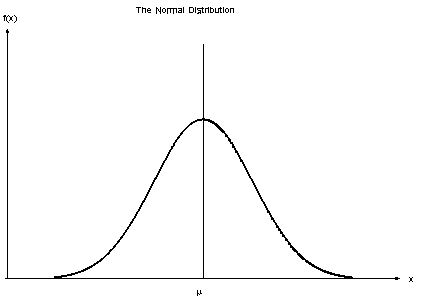
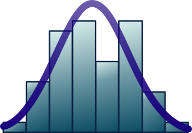

<style>
p.comment {
background-color: #EDBB99;
padding: 10px;
border: 1px solid black;
font-style: italic;
}
</style>

<style>
p.comment1 {
background-color: #A2D9CE;
padding: 10px;
border: 1px solid black;
}
</style>

<style>
p.comment2 {
background-color: #EDBB99; 
padding: 10px;
border: 1px solid black;
}
</style>

<style>
p.comment3 {
background-color: #FDFEFE; 
padding: 10px;
border: 1px solid black;
}
</style>


```{r setup, include=FALSE}
library(tidyverse)
library(learnr)
library(gradethis)
library(checkr)
library(sortable)
library(modelr)
library(broom)

knitr::opts_chunk$set(echo = FALSE)
tutorial_options(exercise.checker = grade_learnr)
tutorial_options(exercise.startover = TRUE)
tutorial_options(exercise.completion = FALSE)

new_recorder <- function(tutorial_id, tutorial_version, user_id, event, data) {
    #cat(tutorial_id, " (", tutorial_version, "): ", user_id, ", ", event, ", ", "\n", sep = "")
  cat(tutorial_id, " (", tutorial_version, "): ", user_id , "\n", sep = "")
  cat("event: ", event, "\n", sep = "")
}

options(tutorial.event_recorder = new_recorder)

set.seed(42)
x <- 1:10 + rnorm(10, 0, 0.5)
y <- 2*x + rnorm(10, 0, 1)
sim_df <- tibble(x, y)
```

## What is a model

### Video introduction

This video will introduce you to the concept of *models*, and in particular the *linear model* (which you may already be familiar with as a *line of best fit*).

<iframe width="560" height="315" src="https://www.youtube.com/embed/yeKA0m8M8Dc?rel=0" frameborder="0" allowfullscreen></iframe>

Slides: [PDF](https://drive.google.com/file/d/1WeYmoYPQaVRZXJyxxTCbeRQ7XdCazFCn/view?usp=sharing)

### "Correlation does not imply causation"

A common saying when working with models is that "correlation does not imply causation". *What does this mean?*

When we create a linear model (e.g. a line of best fit), we have 2 variables:

* $y$, the response variable
* $x$, the explanatory variable

We are implicitly saying that the values of $x$ *explain* the values of $y$, or alternatively that the $y$ variable *responds* to changes in $x$. This language implies that $x$ is directly causing $y$, and not the other way around.

However...

The linear model cannot actually tell us which variable is causing changes in the other (**causation**). Just because we decide to call one variable $y$ and the other $x$, does not mean that is the direction of effect in the real world.

For example, taller people generally weigh more, but there is nothing stopping us from making height the response variable (y), even though most people would say that it makes no sense that your weight *causes* your height.

In fact, none of the variables in your model could directly *cause* a change in the other. For example, there might be a third variable (that's not in your model) that actually causes the change in your model.

Therefore, even if there seems to be a straight line relationship between two variables, we cannot definitively say that once causes the change in the other - only that they are **correlated**.

<!--
TODO:
- quiz questions on this
-->

## Creating models in R

### Video introduction

<iframe width="560" height="315" src="https://www.youtube.com/embed/FSoPzQLfUKw?rel=0" frameborder="0" allowfullscreen></iframe>

Slides: [PDF (same as before)](https://drive.google.com/file/d/1WeYmoYPQaVRZXJyxxTCbeRQ7XdCazFCn/view?usp=sharing)

### Let's create a linear model

Let's create your first linear model in R, using a simulated dataset called `sim_df`.

This is what the first few rows of the dataset look like:

```{r}
sim_df %>% head()
```

As you can see, there are two variables, $x$ and $y$. Here's what they look like:

```{r}
sim_df %>%
  ggplot() +
  geom_point(aes(x,y))
```

This looks like a pretty good candidate for a linear model, so let's create one.

We'll do that with the `lm` function. The general syntax of this function is:

```r
lm(response ~ explanatory, data = _______)
```

* `response` and `explanatory` are the column names of those two variables. 
* The `data` parameter expects the dataframe containing those columns.

<div class="comment2">
What's going on with `response ~ explanatory`? This is what's know as an R *formula*.

The mathematical forumla for a linear model is $y=mx+c$. In R, we would write this as `y ~ x`: i.e. we replace $=$ with `~`, and we only include the actual variables. From this, R infers that we want to estimate the model's coefficients (the slope, $m$, and the intercept, $c$).
</div>

<p class="comment3">
Fill in the blanks in the lm function with the two variables, `y` and `x`, and the dataframe `sim_df`.
</p>

```{r hclgfwuhnrvyquge, exercise = TRUE, warning=FALSE, message=FALSE}
sim_model <- lm(_____ ~ _______, data = _____)
```

```{r hclgfwuhnrvyquge-hint-1}
# hint text
"Make sure to get the variables in the right order!"
```

```{r hclgfwuhnrvyquge-solution}
sim_model <- lm(y ~ x, data = sim_df)
```

```{r hclgfwuhnrvyquge-check, warning=FALSE, message=FALSE}
grade_code()
```


<div class="comment3">
**Note**: Unfortunately the `lm` function is a part of the core R programming language that predates the `tidyverse` packages. Unlike the tidyverse functions, the first argument of `lm` is the formula, not the dataframe. Therefore, you cannot pipe a dataframe to `lm`, because pipe inserts the dataframe into the first argument position (which will cause an error).
</div>

## Fitting models

### Video introduction

<iframe width="560" height="315" src="https://www.youtube.com/embed/kCIg9qiNsMA?rel=0" frameborder="0" allowfullscreen></iframe>

Slides: [PDF (same as before)](https://drive.google.com/file/d/1WeYmoYPQaVRZXJyxxTCbeRQ7XdCazFCn/view?usp=sharing)


### Your model's coefficients

We usually want to report the slope and intercept of a linear model. The slope is expecially useful to report, because it indicates how much $y$ changes as $x$ changes.

We can report the model coefficients with the `tidy()` function from the `broom` package. The syntax is like this:

```r
your_model %>%
  tidy()
```

<p class="comment3">
Replace the blank with the correct function to report the coefficients.
</p>

```{r create_model, include=FALSE}
sim_model <- lm(y ~ x, data = sim_df)
```

```{r hojasacuvjabzyjp, exercise = TRUE, exercise.setup="create_model"}
sim_model %>%
  _______()
```

```{r hojasacuvjabzyjp-solution}
sim_model %>%
  tidy()
```

```{r hojasacuvjabzyjp-check}
# check code
gradethis::grade_code()
```

```{r lm_slope_quiz}
question(
  "What is the slope of the linear model?",
  answer("1.27"),
  answer("1.75", correct = TRUE),
  allow_retry = TRUE
)
```

```{r lm_intercept_quiz}
question(
  "What is the intercept of the linear model?",
  answer("1.27", correct = TRUE),
  answer("1.75"),
  allow_retry = TRUE
)
```


### $R^2$: how good is your model?

So we've reported the slope and intercept: however, these don't tell us about how well the model fits the data, i.e. how close the points are to the model's line.

For example, you could have a steep slope (suggesting that a change in $x$ is correlated with a big change in $y$), but the points could be scattered a long way from the line (i.e. large residuals). For example, consider these two graphs:

```{r}
set.seed(42)
x1 <- 1:10 + rnorm(10, 0, 0.5) 
x2 <- 1:10 + rnorm(10, 0, 0.5)
x <- c(x1, x2)
y <- c(x1 + rnorm(10, 0, 3), 2*x2 + rnorm(10, 0, 0.5))
series <- c(rep("Low slope, large scatter", 10), rep("Steep slope, low scatter", 10))
tibble(x, y, series) %>%
  ggplot(aes(x,y)) +
  geom_point() +
  geom_smooth(method="lm", se = FALSE) +
  facet_wrap(~ series)
```

We can use a statistic called $R^2$ (R-squared). You can think of $R^2$ as *the % of the variation in $y$ that is explained by the explanatory variable, $x$*.

$R^2$ varies between 0 and 1. 1 means that the model explains all the variation: i.e. the points fall exactly on the line of best fit! As the points get further from the line, $R^2$ will decrease.

We can report the $R^2$ by piping a model to the `glance()` function.

```r
your_model %>%
  glance()
```

<p class="comment3">
Fill in the blank with the correct function to report the $R^2$ value of your model.
</p>

```{r pejquogcchrafyyt, exercise = TRUE, exercise.setup="create_model"}
sim_model %>%
  _______()
```


```{r pejquogcchrafyyt-solution, exercise.setup="create_model"}
sim_model %>%
  glance()
```

```{r pejquogcchrafyyt-check}
# check code
gradethis::grade_code()
```

You'll note that `glance` reports a whole bunch of statistics. We only care about the first column, `r.squared`, and can ignore the rest.

```{r rsquared_quiz}
question(
  "What is the R-squared value of your model?",
  answer("0.935", correct=TRUE),
  answer("0.926"),
  answer("1.52"),
  answer("114"),
  allow_retry = TRUE
)
```


### What's a good $R^2$?

We can use the $R^2$ to determine how "good" a model is. However, what value of $R^2$ is "good"?

It turns out that the answer to this question varies widely between different areas of science.

In physics, we often collect data from simple systems where data can be collected very accurately, so physicists expect high $R^2$ values in their experiments. For example, if you are measuring the speed of an object, there will be only one or two variables that will affect the speed, so you should get a very good correlation. Physical variable are generally easy to predict.

In contrast, the social sciences (e.g. psychology or economics) will accept lower $R^2$ values, because there social systems are very complex with a huge number of interacting variables. For example, you could measure the effect of a good night's sleep on students' exam results the next day, but there are going to ge a lot of other things that affect how well a student does (such as how much they studied). As a result, even if sleep and exam results are related, the correlation will be very weak. Psychologists may be quite happy with $R^2$ values of less than 0.5 (i.e. 50%).

For the purposes of this class, you can think of an $R^2$ > 0.5 as good, an $R^2$ > 0.25 as okay, and an $R^2$ > 0.1 as weak.

## Model assumptions

### Assumptions of the linear model

All models make assumptions - that's how they are able to simplify complexity.

The linear model makes these assumptions:

1. **Linearity**: we assume that there is a linear relationship between the response and explanatory variables (i.e. that they fall more or less along a straight line).

2. **Nearly normal residuals**: the residuals are normally distributed around the model line.

3. **Constant variation of residuals**: the variation in residual size (above and below the model line) is similar in all parts of the model.

4. **Independent observations**: Each observation (i.e. each $(x,y)$ point) was generated independently from the others.

These might seem a little complicated, but they all make some intuitive sense when you think about what they mean, so let's go through them one-by-one.

### Linearity

For a simple regression with one explanatory variable, we can see whether there is a linear relationship by plotting a scatter plot with the model line. For example, compare these two plots:

```{r}
set.seed(42)
x1 <- 1:20 + rnorm(20, 0, 0.5) 
x2 <- 1:20 + rnorm(20, 0, 0.5)
x <- c(x1, x2)
y <- c(400*x1 + rnorm(20, 0, 100), x2^3 + rnorm(20, 0, 100))
series <- c(rep("Linearity condition satisfied", 20), rep("Linearity condition violated", 20))
tibble(x, y, series) %>%
  ggplot(aes(x,y)) +
  geom_point() +
  geom_smooth(method="lm", se = FALSE) +
  facet_wrap(~ series)
```

In the left-hand graph the points obviously fall on a straight line (a linear trend). However, in the right-hand side plot, there is an obvious *non-linear* trend, and that data violates this assumption of the linear model.

<!--
TODO:
- Add a quiz/code question here asking students to interpret their own graph
- Add quiz questions of other graphs that are harder to interpret
-->

### Nearly normal residuals

The best linear model is the one that has the smallest sum of the squared residuals. We don't need to worry too much about the mathematics behind this - however, you should be aware that the math does make the simplifying assumption that the residuals have a *normal* distribution (more or less).

The normal distribution is a bell-shaped distribution:

```{r}

```

We can plot a histogram of the residuals and see if that has a (more or less) normal distribution:

```{r}

```

To do that, we will need to:

1) Calculate a new column in our dataframe holding the residuals.
2) Plot the residuals.


This starter code calculates the residuals using your model and a useful function called `add_residuals`. The new dataframe (with an additional column called `resid` to hold the residuals), has been saved in a new variable called `sim_model_df`.

<p class="comment3">
Use this new `sim_model_df` dataframe to create histogram of the `resid` column (fill in the correct geom function and the `resid` column name in the appropriate blanks).
</p>

```{r yopfnelideskkmld, exercise = TRUE, exercise.setup="create_model"}
sim_model_df <- sim_df %>%
  add_residuals(sim_model)

sim_model_df %>%
  ggplot() +
  _______(mapping = aes(x = ________), bins = 5)
```

```{r yopfnelideskkmld-solution}
sim_model_df <- sim_df %>%
  add_residuals(sim_model)

sim_model_df %>%
  ggplot() +
  geom_histogram(mapping = aes(x = resid), bins = 5)
```

```{r yopfnelideskkmld-check}
# check code
gradethis::grade_code()
```

As you can see, our histogram does not look like a perfectly normal distribution - however, the randomly simulated `sim_df` dataframe was created with normal residuals! 

This is the challenge of working with random data: it will rarely look "perfect". This is why we say that we only expect *nearly* normal residuals to satisfy this condition. 

In your graph, there does appear to be a roughly normal distribution (of course, it's easy to say that when we know it should be!): 

* There's a single higher peak in the middle.
* The heights of the bins decrease on either side.
* There seem to be a similar number of residuals on either side of the central peak (i.e. the distribution is symmetric).
* Although the left-most bin is higher than we might expect, this can be explained as just a quirk of the data (remember that all data is a little bit random), especially as this dataset is small (such random variation tends to get "averaged out" as the number of data points increases).

### Constant variability of residuals

The residuals of a linear model are arranged above and below the line. As we saw in the previous section, this arrangement should look similar to a normal distribution, i.e.

* most residuals will be small (close to the line)
* a few residuals will be large

The linear model also assumes that this normal distribution is the same in all parts of the model (i.e. at both high and low value of $x$).

For example, in this model, we can clearly see that the variation in the residuals *is not constant* - this is a violation of this third assumption of the linear model:

```{r}
set.seed(46)
x <- 1:100 + rnorm(100)
y <- x + 100:1 * rnorm(100)
ggplot(mapping = aes(x, y)) +
  geom_point() +
  geom_smooth(method = "lm", se = FALSE) +
  labs(title = "Decreasing variation in points")
```

In the graph above, the points on the right lie much closer to the line: i.e. the residuals will be smaller.

For simple linear models like this (with only a single explanatory variable $x$), we can get a reasonable idea of the variability of the residuals just by looking at a scatter plot of the model, as above.

For comparison, here is the model you fit earlier:

```{r}
sim_df %>%
  ggplot(mapping = aes(x, y)) +
  geom_point() +
  geom_smooth(method = "lm", se = FALSE)
```


```{r assumption_3_quiz}
question(
  "Does your model (as shown above) satisfy the linear model's assumption of constant variability of residuals?",
  answer("Yes, the model satisfies this assumption.", correct = TRUE),
  answer("No, the model violates this condition."),
  allow_retry = TRUE
)
```


### Independent observations

The fourth (and final) assumption of the linear model is that all the observations (data points) were generated *independently*.

We will not worry to much about this assumption in this course, as the datasets we give you will have independent observations (for the most part).

But what does it mean for observations to be *non-independent*?

Consider the stock market: we could have a dataset that contains measurements of a company's stock price at the end of each day. However these observations are not independent. A stock price will rise or fall, but this change will be *from the previous observation*. I.e. if the stock ends day 1 at 100, it will probably end day 2 pretty close to 100. Therefore, the data points are not independent.

For comparison, think about measuring the height of all the students in this class: one student's height does not significantly affect anothers, so these observations are all independent.


<!--
TODO: 
add quiz 
-->

